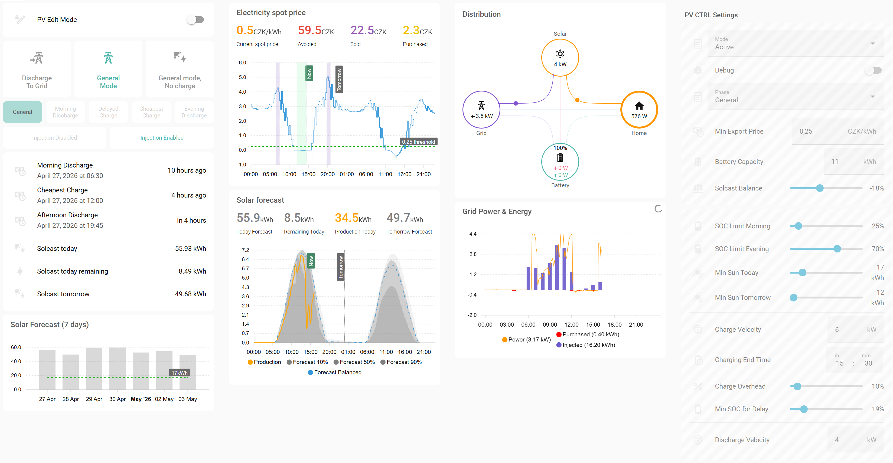

# Introduction

After a period with a fairly attractive flat rate for selling energy, I had to switch to spot prices. This introduced a need to squeeze as much as possible from the setup to increase the return on investment (ROI).



As an owner of Wattsonic gen3, it's prepared with this inverter in mind, though it can be easily reconfigured for other devices (see The Code section).

> :bulb: There are several mature yet complex solutions covering PV operation optimization, such as EVCC or PredBat. They are definitely worth checking out. My intention was to create something simple for a simple use case (and deliver fast). I also wanted to gain first-hand experience with building Home Assistant automation.

> :sparkles: Some parts of the code as well as text polishing have been done with the help of AI.

# The Automation Concept

The main idea is based on the observed evolution of spot prices during each day.


It usually features two peaks - morning and evening - and a trough around midday. The peaks - typically short - are a good opportunity to sell excess energy accumulated in the battery at the best prices. Recharging is shifted to cheapest hours, allowing to utilize time of dropping but still good prices to sell even more produces PV energy.

To avoid battery energy shortages, it uses PV forecasts to support the decision logic.

> :exclamation: It's important to be aware that repeated charging and discharging of the battery influences its wear. Watch the discharge velocity (C-rate). The recommended C-rate is within the 0.3–0.7C range.

The observations introduced above lead to a set of general automation rules:

1. Sell energy stored in batteries during peak price periods
1. Delay battery charging during morning hours to keep selling PV production at good prices
1. Charge the battery during the cheapest price window
1. Discharge only if enough PV energy is forecasted
1. Maintain a minimum energy level in the battery to avoid buying energy for household operations

This translates into four phases.

## Discharge (morning and evening)

While it could be limited to a single discharge, splitting it into two has benefits:

* Prices during evening hours are usually slightly higher
* Due to the narrowness of peaks, it’s better to distribute energy across both
* Splitting provides better margin management
* Morning PV forecast allows a last-minute decision to skip the morning discharge

Discharging must not result in an energy deficit later. Therefore, no discharge is triggered if insufficient PV energy is forecasted. At the same time, minimum battery levels must be maintained. This also includes support for the "Charge Delay" time period.

The configuration of edge conditions may differ between installations. It should be set with a safe margin to avoid buying energy.

> :electric_plug: To sell stored energy, the inverter is switched to a mode that exports battery energy to the grid. Depending on the inverter model and/or firmware version, such a mode may be available as a main operating mode or as a scheduled mode (Time of Use, ToU).
This implementation uses a scheduled mode compatible with Wattsonic Gen3 firmware v2.

## Charge Delay

This is the period between the morning discharge and the cheapest charging window.

During this time:

* The system should behave similarly to General mode, but
* PV production should prioritize export to the grid over charging the battery

This period includes several safeguards:

* It is activated only if it follows the morning discharge. This is based on the assumption that if discharge was skipped, there likely isn’t enough PV energy available.
* During this period, the battery still supplies energy to the household if PV does not cover demand. If battery SOC drops to the predefined limit, the mode is interrupted and the inverter returns to normal operation, prioritizing battery charging from PV.
* If spot prices drop below a certain limit, selling no longer makes sense. Instead of suppressing PV production, it is better to use it to charge the battery.

> :electric_plug: This mode might be called Feed-in Mode. If unavailable, limiting the charging current may help achieve a similar effect, though Feed-in Mode still allows charging if PV production exceeds export limits.
Wattsonic Gen3 with firmware 2.x does not provide Feed-in Mode; it was introduced in later versions.

## Cheapest Charge

This phase turns inverter into general mode, thus it's nothing special except it finishes the Charge Delay, influencing income from that phase. Potentially we want to delay cheapest charge as much as we can, but it's more imporant to to ensure enough time to fully charge the battery. Charging time depends mainly on weather conditions and may also be influenced by household usage.

Here are a few parameters that help calculate the required charging window:

* Solcast Balance – Solcast provides solar forecasts as three percentiles: 10%, 50%, and 90%. The balance allows shifting toward a more pessimistic (negative values) or optimistic (positive values) prediction. A value of 0% corresponds to the 50th percentile.
* Charging End Time – If the cheapest hours occur later than usual and/or poor weather requires more charging time, the battery might not charge sufficiently. This setting mitigates that by shifting the charging window earlier
* Charge Overhead – Normally, demand is calculated based on battery size, the remaining SOC, and forecasted PV energy capped by maximum charging velocity. It does not take a household consumption or other losses into account. This parameter increases the predicted energy demand by a given factor, widening the charging window.

On top of that, if unselable prices extend the cheapest time span, the phase will start as early as possible.

> :electric_plug: Charging during the cheapest hours requires no special inverter mode - just the standard “General” mode. 

# The Package

For easier deployment (and no better option) the entire solution is implemented as a Home Assistant package:


**Proxy Sensors**
These act as an API between third-party integration sensors, representing the state of the inverter, solar forecast, and prices. This approach ensures that the code never directly references third-party sensors, making it independent of their data formats. If integrations are replaced, only the proxy sensors need to be adjusted.

**Script**
Like proxy sensors, the `script.pv_ctrl_inverter` acts as an abstraction layer for controlling the inverter. It is a single, parameterized script implementing inverter-specific commands.

**TimeWindow Sensors**
These template sensors calculate the start and end of charging and discharging periods for the current day:

* `sensor.pv_ctrl_most_expensive_hours_morning` – morning discharge window
* `sensor.pv_ctrl_most_expensive_hours_afternoon` – evening discharge window
* `sensor.pv_ctrl_cheapest_hours` – cheapest charging window

They also store additional data in attributes.data, used both by automation and for dashboard display.

**Automation State and Config Entities**

Both are implemented as input entities, surviving Home Assistant restarts.All of them are exposed on GUI.

| Entity                                       | Description |
|----------------------------------------------|-------------|
| `input_boolean.pv_ctrl_edit_mode`            | Used for dashboard only, preventing accidental changes to the settings. It's especially important for mobile views, where current HA UI makes an accidental change of parameters more then likely |
| `input_boolean.pv_ctrl_debug`                | Toggles recording the debug informations to the Home Assistant log. Automation has to be in `Active` or `Dry Run` mode |
| `input_select.pv_ctrl_mode`                  | Allows to run the automation either for real or in testing mode (`Dry Run`). The `Dry-run` does everything the `Active` mode does without calling Inverter for changing modes. When `Disabled`, the automation internally does nothing, though, like template sensors, it still collects data. |
| `input_select.pv_ctrl_phase`                 | Represents the current automation phase (under normal circumstances not intended for manual editing). Possible values are `General`, `Morning Discharge`, `Charge Delay`, `Cheapest Charge`, `Evening Discharge`. |
| `input_number.pv_ctrl_min_suncast_current_day` | Minimum forecasted energy for today; required for the morning discharge |
| `input_number.pv_ctrl_min_suncast_next_day` | Minimum forecasted energy for tomorrow; required for the evening discharge |
| `input_number.pv_ctrl_soc_limit_morning`    | SOC limit for morning discharge |
| `input_number.pv_ctrl_soc_limit_evening`    | SOC limit for evening discharge |
| `input_number.pv_ctrl_min_export_price`     | Maximum energy price (per kWh), that prevents exporting energy (e.g., 0.25 CZK). |
| `input_number.pv_ctrl_charge_velocity`      | Maximum charging power, the velocity the battery can be charged with. Used to cap PV energy provided by Solcast |
| `input_number.pv_ctrl_discharge_velocity`   | Maximum discharge power, used to calculate a time needed to discharge battery to requested SOC |
| `input_number.pv_ctrl_battery_capacity`     | Used in calculation of 1% of SOC |
| `input_number.pv_ctrl_solcast_forecast_balance` | Allows setting a balance between 10%, 50%, 90% percentile suncast prediction |
| `input_datetime.pv_ctrl_charge_delay_time_limit` | Limits predicted end time of cheapest charge time window. Might be helpful if cheapest hours (occasionally) starts late afternoon, but you don't want to delay charging so much |

**The Automation**
Finally, `automation.pv_ctrl_executor` is the core component that makes decisions based on its current state and inputs from sensors.

# The code

The Home Assistant package is available on GitHub: [link](https://github.com/michal-bartak/homeassistant-pv-control/blob/main/packages/pv_control.yaml).
If you are not familiar with HA packages, see the [documentation](https://www.home-assistant.io/docs/configuration/packages/).

**Requirements**
* Wattsonic gen3 integration by GiZMoSK ([GitHub](https://github.com/GiZMoSK1221/hass-addons))
* Solcast ([GitHub](https://github.com/BJReplay/ha-solcast-solar), [HA forum](https://community.home-assistant.io/t/wattsonic-photovoltaic-power-plant-fve-integration/406135))
* CZ Spot prices ([GitHub](https://github.com/rnovacek/homeassistant_cz_energy_spot_prices))
* Dashboard:
  - `custom:apex-charts` for graphs
  - `custom:button-card` for controls
  - `custom:restriction-card` for locking UI elements
  - `cardmod`/`uix` integration

> :exclamation: It is important to maintain consistent unit magnitudes for all sensors and inputs (kW / kWh).

Usage with different integration

It's possible and requires:

* Adjusting the script implementing inverter-specific commands (see below)
* Adjusting proxy sensors to provide expected data to automations (see below)
* Changing monetary units, since original code uses CZK.
* Adjust dashboard, since it uses some unproxied entities directly

**The Script**

Example:
```yaml
action: script.pv_ctrl_inverter
data:
  mode: general
```
Supported modes:

* `general` – Resets inverter to general mode, including restoring unlimited battery charging
* `discharge_grid` – Enables discharge to the grid (implemented using Wattsonic scheduling)
* `feedin` – Prefers exporting energy to the grid instead of charging the battery (currently achieved by limiting charging current)
* `charge_disabled` – Sets charging current to zero (unused)
* `charge_enabled` – Sets charging current to maximum (unused)
* `injection_enabled` – Enables grid export
* `injection_disabled` – Disables grid export

The last two operations are used by a separate automation that prevents selling energy when the price is below a configured threshold.

**Proxy sensors**

These are set of template sensors that prepare and optimize data for the rest of implementation.


| Entity                                       | Description |
|----------------------------------------------|-------------|
| `sensor.pv_ctrl_battery_soc`                 | provides SOC of PV system battery. Valid values are from range 0-100 and represents percentage of battery charge |
| `sensor.pv_ctrl_solar_forecast_today` and<br>`sensor.pv_ctrl_solar_forecast_tomorrow`|  Both provide array of forecasted energy (in kWh) for each 30 min period.<br>The period length is provided by `attributes.period` attribute.<br>Data are stored under `attributes.data` as array of following structure `{time: <time>, energy: <val1>, energy_10: <val2>, energy_50: <val3>, energy_90: <val4>, power_balanced: <val5> }`. The  `power_10`, `power_50` and `power_90` represents 10th, 50th and 90% percentile predition originally provided by Solcast; The `power_balanced` is the result of balancing between pesimistic and optimistic values. <br>The `energy` carries a value of energy predicted for the period (30 min) derrived from the balanced power.
| `sensor.pv_ctrl_spot_electricity_prices`           | Provides array of prices (for kWh) valid within 15-minute intervals.<br>The period length is provided by `attributes.period` attribute.<br>Data are stored under attributes.data as array of following structure: `{time: <time>, val: <price>}` |
