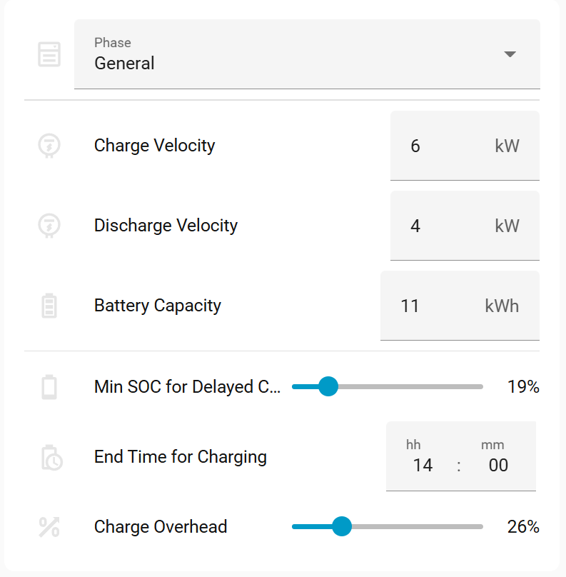

# Introduction 
> :sparkles: Some bits of code as well as text polishing has been done with help of AI.

After a time period with a pretty good flat rate of selling energy I had to switch to spot prices. It introduced a need to squeeze as much as possible from this setup for incresing the return of investment (ROI).

> It's prepared for Wattsonic inverter, though it can be easily reconfigured for other devices (see The Code section)

**What it does?**
The main idea is based on observed evolution of spot prices during each day.


It usually feature two peaks: morning and evening, and a trough around midday. The peaks - typically short - are good opportunity to sell excess of energy cumulated in battery for best prices. To avoid battery energy shortage, it uses PV forecast to support decission logic.

There are several mature yet complex solutions for this task already, to mention EVCC or PredBat. They are definitively worth checking. My idea was to create someting simple for simple use-case. Also I wanted to collect first hand experience with Home Assistant automation.

> :exclamation: It's important to be aware that repeatable charging and discharging battery incluences its wear. Whatch out discharge velocity (C-rate). The advised C-rate is within 0.3-0.7C range.

# The Automation Concept

Observations instroduced above lead to a set of general automation rules:

1. Sell energy stored in batteries during peak price periods
2. Delay battery charging during morning hours, to sell PV production for good prices
3. Charge the battery during the cheapest price window
4. Discharge only if enough PV energy is forecasted
5. Secure minimum energy in battery to avoid buying it for household operations

This together introduces four phases:

## Discharge (morning and evening)

While it could be limited to single discharge, split into two has benefits:
* prices during evening hours are ussually a bit higher
* Due to narrowness of peaks it's better to share energy over two peaks
* split into two gives better margin management
* morning PV forecast allows last minute decission to skip the morning discharge

Discharging must not result in an energy deficit later. Therefore no discharge is triggered if not enough PV energy is forecasted. At the same time a minimum battery levels must be maintained. It includes support for "Delayed Charge" time period.

The setting of edge conditions might differ from installation to installation. It must be set with safe margin to avoid buying energy.

> :electric_plug: To sell stored energy, the inverter is switched to a mode that exports battery energy to the grid. Depending on the inverter model and/or firmware version, such a mode may be available as a main operating mode or as a scheduled mode (Time of Use, ToU).
This implementation uses scheduled mode valid for Wattsonic gen3 fw v2

## Delayed Charge

It is the period between morning discharge and the cheapest charging window.

During this time:
- The system should behave similarly to General mode, but
- PV production should prioritize export to the grid over charging the battery.

This period implements several guards:

- it's activated only if proceeds the morning discharge. It comes from assumption that, if discharge has been skipped, then it's gonna be no enough PV energy to play with.

- during this period, the battery still provides energy to the hausehold, in case PV doesn't cover the needs. If battery SOC drops to the predefined limit, the mode is interrupted and inverter returns to regular operational mode, securing battery charge from PV.

- if spot prices drop undel limit, selling does not make sense anymore. Instead of suppressing PV production, it is better to use it to charge the battery.

> :electric_plug: This mode might be called **Feed-in Mode**. If unavailable, limiting the charging current may help achieving a similar result, though Feed-in Mode still allows charging if PV production exceeds export limits.
Wattsonic Gen3 with firmware 2.x does not provide Feed-in Mode. It was introduced in later firmware versions.

## Cheapest Charge

It's important to secure enough time to fully charge battery. The time of charging  depends mainly by a weather. Then might be influced by household usage. 

Here is a few parameters that can help with calculation of needed time window.

- Solcast Balance - Solcast provides probability of Sun power as 3 values: 10%, 50% and 90% percentile. Solcast balance allow to shift toward more pessimistic (negative percentage on the slider) or optimistic prediction (positive percentage). 0% means 50% percentile.

- Charging End Time - If cheapest hours become later than usual and/or bad weather conditions requires more time to charge, it might lead to situation that battery will not charge enough. This setting prevents it by planning the charging time window earlier.

- Charge Overhead - Normally the demand is calculated from battery size, SOC to charge and forecasted PV energy capped by Charge velocity. It does not take into account household usage nor other loses. This parameter increases predicted energy demand for charging by given factor, widen charge time window.



> :electric_plug: Charging during the cheapest hours requires no special inverter mode - just the standard “General” mode. 

# The Package

For no deployment better option, the entire solution is implemented as a Home Assistant package:


**Proxy Sensors**
Consider them as an API between 3rd party integration sensors, respresenting state of inverter, solar forecast and prices. Thanks to this approach, the code never references 3rd party sensors, being independent from their data format. Also, in case of replacing integrations, it's enough to adjust proxy sensors.

**Script**
Like proxy sensors, the `script.pv_ctrl_inverter` plays a role of the proxy for calling the solar inverter.
It's a single, but paramterized script, that implements inverter-specific commands.

Example:
```yaml
action: script.pv_ctrl_inverter
data:
  mode: general
```

Following modes are accepted:
`general` - Resets inverter to general mode, incl. restoring unlimited battery charge
`discharge_grid` - enables discharge mode to the grid. Currently implemented with use of schedule Wattsonic feature, that allows to chose discharge mode. 
`feedin` - make inverter prefer injecting produced energy to the grid, instead of charging battery. Cyrrently chieved by limiting a charge current. 
`charge_disabled` - sets charge current to zero (unused)
`charge_enabled` - sets charge current to maximum (unused)
`injection_enabled` - Enables injection to the grid
`injection_disabled` - Disables injection to the grid

Two latest two operations are utilized by another - independent - automation that prevents selling energy when its price is below configured limit.

**TimeWindow Sensors**
These template sensors calculate start and end of charging and discharging time periods for the current day

- `sensor.pv_ctrl_most_expensive_hours_morning` – time of morning discharge
- `sensor.pv_ctrl_most_expensive_hours_afternoon` – time of evening discharge
- `sensor.pv_ctrl_cheapest_hours` – time of cheapest charging window

These sensors store additional data under attributes.data key. The results are used by automation as well as are presented on the dashboard.

**Automation State and Config Entities**

Both are implemented as `input` entities. Automation state materializes state of the automation logic.Config Entities provide option to customize and control the automation.


| Entity                                       | Description |
|----------------------------------------------|-------------|
| `input_boolean.pv_ctrl_edit_mode`            | Used for dashboard only, preventing accidental changes to the settings. It's especially important for mobile views, where current HA UI makes an accidental change of parameters more then likely |
| `input_select.pv_ctrl_mode`                  | Allows to enable the automation either in `real` or `dry mode`, or `disable` it. The `Dry-run` does everything but requesting changes to the inverter. It's good to test if the automation phases proceed as expected. |
| `input_boolean.pv_ctrl_debug`                | Toggles recording the debug informations to the Home Assistant log |
| `input_select.pv_ctrl_phase`                 | Materializes and provides the current automation phase. Not intended to be edited manually. Possible values are `General`, `Morning Discharge`, `Delayed Charge`, `Cheapest Charge`, `Evening Discharge`. |
| `input_number.pv_ctrl_min_suncast_current_day` | Minimum forecasted energy for today; required for the morning discharge |
| `input_number.pv_ctrl_min_suncast_next_day` | Minimum forecasted energy for tomorrow; required for the evening discharge |
| `input_number.pv_ctrl_soc_limit_morning`    | SOC limit for morning discharge |
| `input_number.pv_ctrl_soc_limit_evening`    | SOC limit for evening discharge |
| `input_number.pv_ctrl_min_export_price`     | Maximum energy price (per kWh), that prevents exporting energy (e.g., 0.25 CZK). |
| `input_number.pv_ctrl_charge_velocity`      | Maximum charging power, the velocity the battery can be charged with. Used to cap PV energy provided by Solcast |
| `input_number.pv_ctrl_discharge_velocity`   | Maximum discharge power, used to calculate a time needed to discharge battery to requested SOC |
| `input_number.pv_ctrl_battery_capacity`     | Used in calculation of 1% of SOC |
| `input_datetime.pv_ctrl_charge_delay_time_limit` | Limits predicted end time of cheapest charge time window. Might be helpful if cheapest hours (occasionally) starts late afternoon, but you don't want to delay charging so much |
| `input_datetime.pv_ctrl_solcast_forecast_balance` | Balance between 10%, 50%, 90% percentile suncast prediction


**The Automation**
Finally, the `automation.pv_ctrl_executor` is the core component that makes decissions based on its current state and inputs provided by sensors.

# The code

The Home Assistant package is available under Github [link](https://github.com/michal-bartak/homeassistant-pv-control/blob/main/packages/pv_control.yaml).
In case you are not familiar with HA packages, here is the [documentation](https://www.home-assistant.io/docs/configuration/packages/).

**Requirements**
* Wattsonic gen3 integration by GiZMoSK ([GitHub](https://github.com/GiZMoSK1221/hass-addons))
* Solcast ([GitHub](https://github.com/BJReplay/ha-solcast-solar), [HA forum](https://community.home-assistant.io/t/wattsonic-photovoltaic-power-plant-fve-integration/406135))
* CZ Spot prices ([GitHub](https://github.com/rnovacek/homeassistant_cz_energy_spot_prices))

> :exclamation: It's important to maintain normalized unit magnitude for all sensors and input values: kW / kWh

Reconfiguring for other coverters is possible. It requires to adjust:
- the script, implementing commands valid for the inverter
- proxy sensors, securing the same output data format.

# The Dashboard


The design of the dashboard is a matter of personal preference. This one grown during development to help visualization of relationships between variables and to allow manual control in case the automation behaves unexpectedly (which can happen during development).

Configuration controls are protected by an Edit Mode toggle to prevent accidental changes - especially useful on mobile devices.

The top buttons control inverter modes. The five buttons below represent automation phases.

This dashboard uses:
- `custom:apex-charts` for graphs
- `custom:button-card` for controls
- `custom:restriction-card` for locking UI elements
- `cardmod`/`uix` integration
