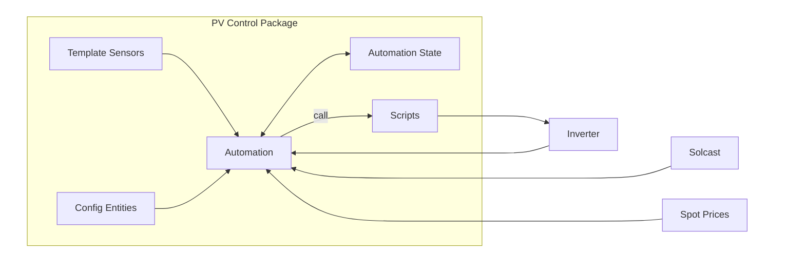
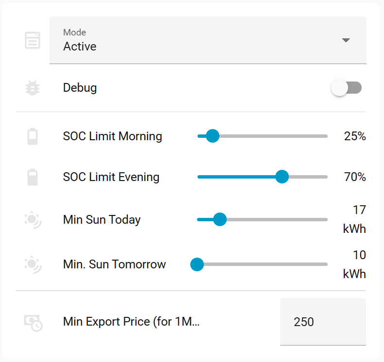

# Introduction

The idea of a household PV plant as a money-making machine was never really accurate, even if advertisements sometimes make it seem that way. Anyone who had that expectation was likely brought back to reality fairly quickly.

In fact, household's PV systems are often only marginally profitable—unless they are also viewed as a hobby. The initial investment is quite high. Larger systems perform better outside the summer season, but they are also more expensive (especially due to batteries). In most cases, the return on investment is not expected earlier than 10 years.

ROI depends on several factors. Let’s break them down.

# Understanding PV Plant ROI

The most important fact is that the gross price of purchased electricity is several times higher than the price at which electricity is sold. In the Czech Republic, households sell electricity at net prices. While no regulatory costs are applied on the selling side, intermediary companies charge various handling fees, reducing the net income.

At the same time, purchasing electricity includes additional regulatory costs such as distribution, network maintenance, and special taxes—all of which are further increased by VAT.

Here is the evolution of total selling and purchasing prices over the past years:


The ROI (Return on Investment) is built on two main components:

- **PV energy consumed by the household** – This should form the largest portion of ROI. It represents the cost of electricity you did not have to buy thanks to your PV system. The more PV energy you can store and use within the household, the better.
- **PV energy sold** – Typically, more PV produced energy is sold than utilized, but its total contribution to ROI is significantly smaller.

Given this, income from sold energy is only a fraction of total ROI. In my household, the ratio was approximately 1:4 in 2025.


There are several ways to manage electricity prices. In most countries, it is possible to choose between flat rates and spot pricing for both buying and selling independently.

Using spot prices for both (so-called “spot surfing”) is likely the most efficient approach. However, it requires adapting the entire household to shift consumption to the cheapest time periods. I guess not every family is ready for that. We are not.

I opted for a hybrid approach: buying electricity at a flat rate (preferably fixed for several years, especially in today’s uncertain environment) and selling at spot prices.

Selling at spot prices opens opportunities for some optimizations. This article presents a simple yet effective method of using spot prices and weather forecasts to extract additional value from a PV system.

To make this work, reliable data sources are essential. Spot prices are officially published in advance. They have to be imported to Home Assistant. For PV production forecasting, **Solcast** is the best solution I know. It offers a free tier for hobby users (with some limitations) and works very accurately for my location.


The upper graph shows spot prices. Next-day prices are typically published in the afternoon, around 2 PM.

Daily price patterns usually feature two peaks: morning and evening, and a trough around midday. The peaks are typically short, while the midday dip can sometimes last for several hours.

The lower graph shows predicted PV production based on data from Solcast. The forecast is updated multiple times per day, improving accuracy over time.

# The Automation Concept

These observations lead to a set of automation rules:

1. Sell energy stored in batteries during peak price periods
2. Delay battery charging and sell PV production during morning hours
3. Charge the battery during the cheapest price window

This sounds simple, but requires proper setup. First, your PV inverter must be integrated with Home Assistant in a way that allows control over its operating modes. Available features may depend on the inverter model and firmware version.

## Discharge

To sell stored energy, the inverter must be switched to a mode that exports battery energy to the grid. This may be available as a main operating mode or as a scheduled mode (Time of Use, ToU).

Discharging must not result in an energy deficit later. As mentioned, buying electricity is much more expensive than selling it. Therefore, minimum battery charge levels must be maintained.

In my setup:
- 70% SOC is reserved after evening discharge
- 25% SOC is reserved after morning discharge

This works well for my household needs.

> It is possible to sell more energy in the evening at the expense of morning discharge. This may be more profitable since evening prices are usually higher. However, splitting discharge into two phases provides a buffer for unexpected evening or night consumption (e.g., washing, gaming).

Energy shortages can also result from poor weather. If low PV production is expected the next day, it is better to keep energy stored rather than sell it.

I use Solcast forecast data for this purpose. It provides daily energy predictions as well as hourly breakdowns. While fine-grained optimization is possible, daily totals are sufficient in my experience.

Discharge is triggered only if the forecasted energy exceeds a defined threshold. But how should this threshold be calculated?

In principle, it needs to cover three things:

1. **Daily household consumption** – the PV production must be sufficient to power the household throughout the day
2. **Battery recharge** – there must be enough excess energy to recharge the battery back to 100%
3. **Safety margin** – an additional buffer to account for forecast inaccuracies and to avoid purchasing energy from the grid

The margin is important because PV forecasts are never perfect, and household consumption may vary. Without it, the system may end up buying expensive electricity later.

In practice, this threshold does not need to be calculated with high precision. A conservative estimate based on typical daily consumption and battery size is usually sufficient. In practive I splitted decission making into two separate conditions approximated to:

1. **Predicted PV production tomorrow** - 10kWh - below this value, evening discharge is not triggered
2. **Predicted PV production today** - 17kWh - below this value, morning discharge is not triggered

> Selling energy despite low forecast only makes sense if selling prices exceed buying prices. This does happen occasionally, but not often enough to rely on.

## Cheapest Charge

Charging during the cheapest hours requires no special mode—just the standard “General” mode.

## Delayed Charge

It is the period between morning discharge and the cheapest charging window.

During this time:
- The system should behave similarly to General mode, but
- PV production should prioritize export to the grid over charging the battery.

This is typically called **Feed-in Mode**. If unavailable, limiting the charging current may achieve a similar effect, though Feed-in Mode still allows charging if PV production exceeds export limits.

> Wattsonic Gen3 with firmware 2.x does not support Feed-in Mode. It was introduced in later firmware versions.

If spot prices drop too low during this period, selling may no longer be profitable. In that case, it is better to start charging the battery earlier to prepare for potential household consumption.

Discharging mode still can provide energy to the hausehold, in case PV doesn't cover the requirement. However the Delayed Charge phase might take long enough to empty the battery. Because of that I introduced a guard, that disables Delayed Charge if battery SOC drops under predefined limit.

## Optimal Time Windows

Finally, we need to determine optimal time windows for charging and discharging.

These depend on:
- The amount of energy to transfer
- The rate of charging/discharging

In practice, these rates vary due to household consumption and PV output. We may assume that the variation is not significant enough to require precise modeling.

Therefore, calculations are done approximately, using 15-minute intervals and fixed transfer rate. The result is the start time of each window, while the end is determined by reaching target SOC levels.

# The Package

The entire solution is implemented as a Home Assistant package, and it depends on some external components.



The package creates the following entities, all of them are prefixed with `pv_ctrl`.

**Script**
The `script.pv_ctrl_inverter` is a single script, parametrized to implement inverter-specific commands. It's called by the automation. It might be used for manual control of the automation or inverter from dashboard.

Example:
```
action: script.pv_ctrl_inverter
data:
  mode: general
```

Following modes are accepted:
**general** - Resets inverter to general mode, incl. restoring unlimited battery charge
**discharge_grid** - enables discharge mode to the grid. Currently implemented with use of schedule Wattsonic feature, that allows to chose discharge mode. 
**feedin** - make inverter prefer injecting produced energy to the grid, instead of charging battery. Achieved by limiting charge current. 
**charge_disabled** - sets charge current to zero (unused)
**charge_enabled** - sets charge current to maximum (unused)

**Template Sensors**
These sensors calculate start and end of time periods, reflecting automation life-cycle.

- `sensor.pv_ctrl_most_expensive_hours_morning` – Start time of morning discharge
- `sensor.pv_ctrl_most_expensive_hours_afternoon` – Start time of evening discharge
- `sensor.pv_ctrl_cheapest_hours` – Start time of cheapest charging window

All sensors above consist of additional data under attributes.data key. The information is used for the internal logic as well as for dashboard.

**Automation**
The `automation.pv_ctrl_executor` automation is the core component. It implements finite automata, making decissinos based on inputs provided by template sensors mentioned above, as well as state of inverter.

All of them must be adapted if you are using a different inverter than Wattsonic/Solinteg.

**Configuration Entities**

| Entity                                       | Description |
|----------------------------------------------|-------------|
| `input_boolean.pv_ctrl_edit_mode`            | Used for dashboard only, preventing accidental changes to the settings. |
| `input_select.pv_ctrl_mode`                  | Allows to enable the automation either in real or dry mode, or disable it. Dry-run mode does everything but requesting changes to the inverter settings. It's good to test if the automation phases proceed as expected. |
| `input_boolean.pv_ctrl_debug`                | Enables or disables recording debug informations to the Home Assistant log |
| `input_select.pv_ctrl_phase`                 | Tracks the current automation phase. Not intended to be edited manually. Possible phases are `General`, `Morning Discharge`, `Delayed Charge`, `Cheapest Charge`, `Evening Discharge`. |
| `input_number.pv_ctrl_min_suncast_current_day` | Minimum forecasted energy for today required to allow the morning discharge |
| `input_number.pv_ctrl_min_suncast_next_day` | Minimum forecasted energy for tomorrow required to allow the evening discharge |
| `input_number.pv_ctrl_soc_limit_morning`    | SOC limit for morning discharge (25%) |
| `input_number.pv_ctrl_soc_limit_evening`    | SOC limit for evening discharge (70%) |
| `input_number.pv_ctrl_min_export_price`     | Maximum energy price (per MWh), that prevents exporting energy (e.g., 250 CZK). |
| `input_number.pv_ctrl_charge_velocity`      | Expected charging power, the velocity the battery can be charged with. |
| `input_number.pv_ctrl_discharge_velocity`   | Expected discharge power, used to calculate a time needed to discharge battery to requested SOC |
| `input_number.pv_ctrl_battery_capacity`     | Used in calculation of 1% of SOC |
| `input_datetime.pv_ctrl_charge_delay_time_limit` | Limits predicted end time of cheapest charge time window. Might be helpful if cheapest hours (occasionally) starts late afternoon, but you don't want to delay charging so much |




---
- pv_ctrl_charge_forecast_overhead


## External Entities

The automation make use of following entities, that come from other integrations:

### Solcast

- `sensor.solcast_pv_forecast_forecast_today`   - sensor that provides forecasted PV energy today
- `sensor.solcast_pv_forecast_forecast_tomorrow` - sensor that provides forecasted PV energy tomorrow

### Spot Prices

- `sensor.current_spot_electricity_price_15min` - sensor providing current spot price

### Inverter

- `sensor.wattsonic_battery_soc` - Inverter sensor that provides the state of charge of the battery

# Dashboard


The design of the dashboard is a matter of personal preference. This one helps visualize relationships between variables and allows manual control in case the automation behaves unexpectedly (which can happen during development).

Configuration controls are protected by an Edit Mode toggle to prevent accidental changes—especially useful especially on mobile devices.

The top buttons control inverter modes. The five buttons below represent automation phases.

This dashboard uses:
- `custom:apex-charts` for graphs
- `custom:button-card` for controls
- `custom:restriction-card` for locking UI elements

# The Rabbit Hole

During development, it’s very easy to fall into the “just one more feature” spiral. The model presented here is intentionally kept as simple as possible, but there are many directions where it could be extended. For example:

- defining different energy requirements for each day of the week  
- pick up most expensive time periods instead of continuous blocks
- operating fully in the energy/power domain instead of relying on SOC and estimated transfer rates
- planning additional loads for the next day
- introducing a “vacation mode” to reflect lower household consumption
- integrating with a calendar to anticipate changes in usage
- incorporating AI to predict household consumption based on historical data

So, is it worth it?

From a learning and development perspective—definitely yes. It’s a great playground for experimenting and improving your setup.

From a financial perspective, it’s less clear.

More advanced logic means more complex code, more configuration, and more edge cases to handle—such as vacations, holidays, or unusual household behavior. Higher precision and tighter margins also require more accurate predictions, especially for household consumption, which is inherently difficult to model. In practice, this can even place additional expectations on other household members.

And in the end, the improvement in ROI may be marginal.

That said, it always depends on the specific setup. In some cases, the extra complexity might pay off—but it’s worth considering whether the added effort is justified.